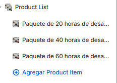
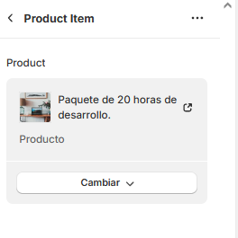
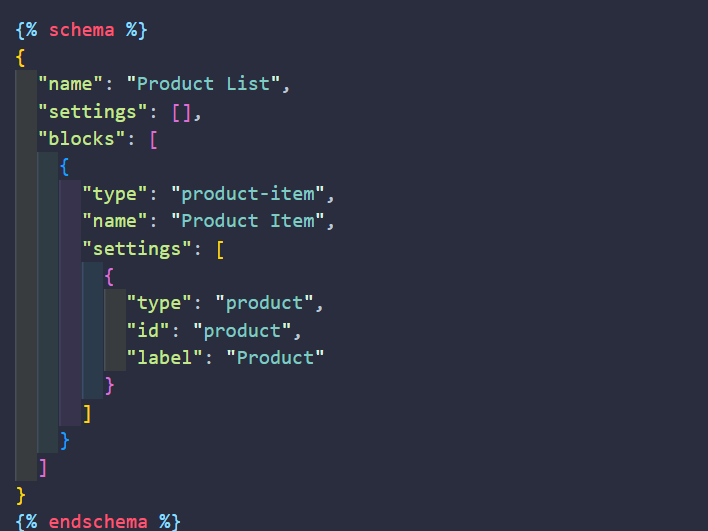
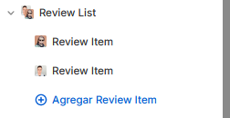
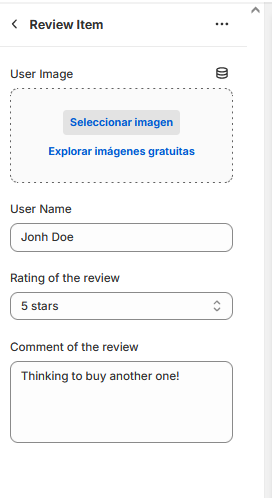

# Documentation

# Implementation of the product list

- go to administration dashboard:

- Go to Product List and select "Add product Item"

- select a product to show

- this eschema is developed into "sections/product-list"

# Implementation of the Review list

- go to administration dashboard:

- Go to Review List and select "Add Review item"

- Add an user name
- Add an avatar image
- Select amount of stars to show inside review
- Add a comment

- this eschema is developed into "sections/product-list"

# ajax add to cart documentation:

Within the ‘assets/product-form.js’ file, the following steps were configured:

- 1. The process starts when the customer selects ‘Add to cart’ on the product of their choice.
- 2. Initially the cart is completely cleaned using function clearCartRequest:
- 3. Then the id of the gift product is searched for, using function getGiftProductToCart
- 4. The gift product is added to the cart, with function addGiftProductToCart
- 5. Finally, the item requested by the customer is added, using function addNewItemToCart
- 6. The above process happens inside the onSubmitHandler function, which prevents the default behaviour of the liquid form, in order to perform the processes needed before adding a new item to the cart.
